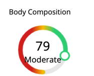
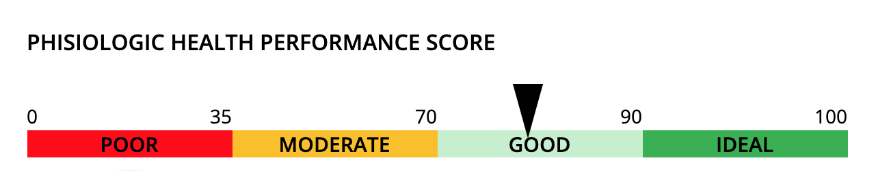

# body360Guide

## Creating a Circle Graph

You just need to add a circle graphic to the html 

```<div class="circle-graph" data-info-source="example-source"></div>```

you would need to introduce the `exampleSource` variable on the `data` object as shown below the following information:

```
exampleSource: {
    title: 'Body Composition',
    score: 79,
    qualification: "Moderate",
}
```

Both the score and qualification are provided by the system in the form of tokens, for example, `score` for Body Composition would can be placed on the html as `PROFILE_MEASUREMENT_BCS`

```
<div class="content">
    <span class="token" contenteditable="false" tokencode="PROFILE_MEASUREMENT_BCS">PROFILE_MEASUREMENT_BCS</span>
</div>
```

> Note: All the tokens in the html shouldn't be visible for the user so they should included inside the div element with a class "uk-hidden".

The qualification can be obtained as the variable `RISKTYPESUMMARY_BCSR_TEXT1`. Creating the token on the HTML section as below:


```
<div class="content">
    <span class="token" contenteditable="false" tokencode="RISKTYPESUMMARY_BCSR_TEXT1">RISKTYPESUMMARY_BCSR_TEXT1</span>
</div>
```

Once placed on `exampleSource` variable it should look like like this

```
exampleSource: {
      title: "Body Composition",
      score: parseFloat($('.content > .token[tokencode="PROFILE_MEASUREMENT_BCS"').text()),
      qualification: $('.content > .token[tokencode="RISKTYPESUMMARY_BCSR_TEXT1"').text(),
    }
```

and should be placed in the `data` dictionary as 

```
data: {
    ..
    exampleSource: {
      title: "Body Composition",
      score: parseFloat($('.content > .token[tokencode="PROFILE_MEASUREMENT_BCS"').text()),
      qualification: $('.content > .token[tokencode="RISKTYPESUMMARY_BCSR_TEXT1"').text(),
    },
    ..
}
```


after that you will be able to see the something like the image below.



## Creating a Line Graph

In order to create a Line graph, you just need to create a html element like the one below:

```<div class="line-graph" data-info-source="phisiologicHealthScore"></div>```

and place in the `data` dictionary the information like in the example below

```phisiologicHealthScore: {
    score: 83,
    header: 'PHISIOLOGIC HEALTH PERFORMANCE SCORE',
  },
  ```

  and you should have something like the graph below.

